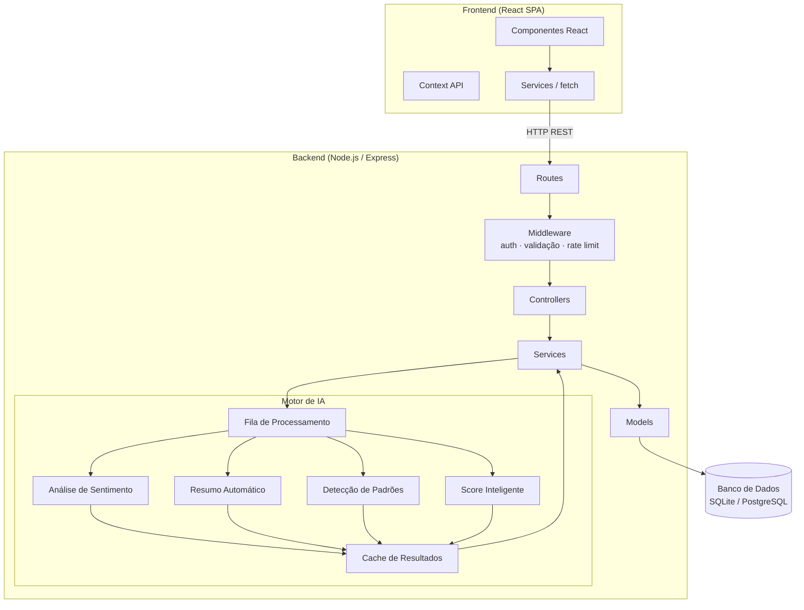
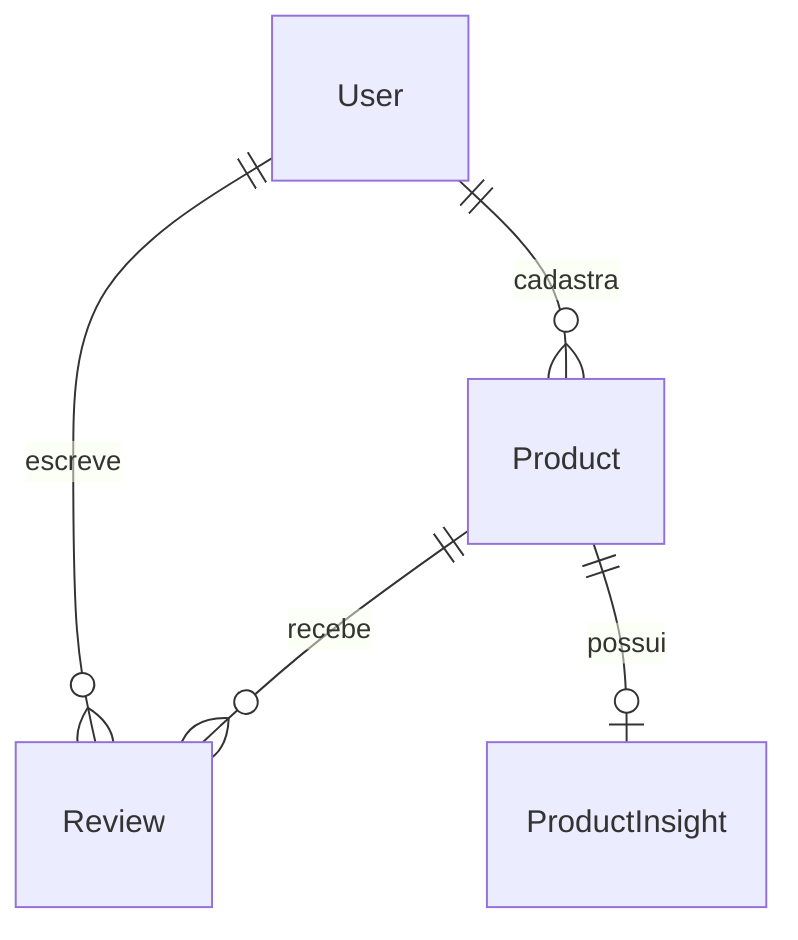

# Design: InsightReview — Smart Product Reviews

## Visão Geral

O InsightReview é uma plataforma web de avaliação de produtos com IA integrada. O sistema transforma avaliações brutas em insights acionáveis: análise de sentimento, resumos automáticos, detecção de padrões recorrentes e score inteligente ponderado.

A arquitetura é dividida em dois serviços independentes:
- **Frontend**: SPA React servida estaticamente
- **Backend**: API REST Node.js/Express com motor de IA integrado

O motor de IA roda dentro do processo do backend (sem chamadas a serviços externos), processando avaliações de forma assíncrona com filas internas e cache de resultados.

---

## Arquitetura



### Decisões de Arquitetura

| Decisão | Escolha | Justificativa |
|---|---|---|
| IA integrada vs. serviço externo | Integrada ao backend | Requisito explícito do produto; reduz latência e dependências |
| Processamento de IA | Assíncrono com fila interna | SLAs de 30–120s inviabilizam resposta síncrona na requisição HTTP |
| Cache de IA | Em memória (Map) com TTL | Evita reprocessamento desnecessário; resultados de IA são estáveis entre atualizações |
| Banco de dados | SQLite (dev) / PostgreSQL (prod) | Flexibilidade para POC sem sacrificar migração futura |
| Autenticação | JWT stateless | Sem necessidade de sessão server-side; compatível com SPA |

---

## Componentes e Interfaces

### Backend — Rotas da API REST

```
POST   /api/auth/register          Cadastro de usuário
POST   /api/auth/login             Login, retorna JWT
POST   /api/auth/logout            Logout (invalida token no cliente)

GET    /api/products               Lista/busca produtos (?q=termo)
GET    /api/products/:id           Detalhes do produto + insights agregados
POST   /api/products               Cadastra novo produto (autenticado)

GET    /api/products/:id/reviews   Lista avaliações com filtro/paginação
POST   /api/products/:id/reviews   Submete nova avaliação (autenticado)

GET    /api/products/:id/insights  Retorna insights de IA (sentimento, resumo, padrões, score)
```

### Backend — Módulos Internos

```
src/
├── routes/
│   ├── auth-routes.js
│   ├── product-routes.js
│   └── review-routes.js
├── controllers/
│   ├── auth-controller.js
│   ├── product-controller.js
│   └── review-controller.js
├── services/
│   ├── auth-service.js
│   ├── product-service.js
│   ├── review-service.js
│   └── insight-service.js        ← orquestra o motor de IA
├── models/
│   ├── user-model.js
│   ├── product-model.js
│   └── review-model.js
├── ai-engine/
│   ├── sentiment-analyzer.js     ← SLA 30s
│   ├── summary-generator.js      ← SLA 60s
│   ├── pattern-detector.js       ← SLA 120s
│   ├── score-calculator.js       ← SLA 30s
│   └── ai-queue.js               ← fila de processamento assíncrono
├── middleware/
│   ├── auth-middleware.js
│   ├── validation-middleware.js
│   └── rate-limit-middleware.js
└── server.js
```

### Frontend — Componentes React

```
src/
├── components/
│   ├── auth/
│   │   ├── LoginForm.jsx
│   │   └── RegisterForm.jsx
│   ├── product/
│   │   ├── ProductCard.jsx
│   │   ├── ProductDetail.jsx
│   │   └── ProductSearch.jsx
│   ├── review/
│   │   ├── ReviewList.jsx
│   │   ├── ReviewCard.jsx
│   │   ├── ReviewForm.jsx
│   │   └── ReviewFilters.jsx
│   └── insights/
│       ├── InsightCard.jsx
│       ├── SentimentChart.jsx
│       ├── PatternTags.jsx
│       └── SmartScore.jsx
├── hooks/
│   ├── useAuth.js
│   ├── useProducts.js
│   ├── useReviews.js
│   └── useInsights.js
├── contexts/
│   └── AuthContext.jsx
├── services/
│   ├── auth-service.js
│   ├── product-service.js
│   └── review-service.js
├── utils/
│   └── validators.js
└── App.jsx
```

---

## Modelos de Dados

### User

```js
{
  id: UUID,
  name: String,           // nome completo
  email: String,          // único, indexado
  passwordHash: String,
  emailVerified: Boolean,
  createdAt: DateTime
}
```

### Product

```js
{
  id: UUID,
  name: String,
  description: String,
  category: String,
  imageUrl: String,
  createdBy: UUID,        // FK → User
  createdAt: DateTime
}
```

### Review

```js
{
  id: UUID,
  productId: UUID,        // FK → Product
  userId: UUID,           // FK → User
  text: String,           // mínimo 20 caracteres
  rating: Integer,        // 1–5
  sentiment: Enum('positive', 'neutral', 'negative', null),
  sentimentProcessedAt: DateTime | null,
  createdAt: DateTime
}
```

### ProductInsight (cache de IA por produto)

```js
{
  id: UUID,
  productId: UUID,        // FK → Product, único
  summary: String | null,
  patterns: {
    strengths: String[],
    weaknesses: String[]
  } | null,
  smartScore: Float | null,       // 0.0–10.0
  simpleAverage: Float | null,
  sentimentDistribution: {
    positive: Float,              // percentual 0–100
    neutral: Float,
    negative: Float
  } | null,
  reviewCountAtLastUpdate: Integer,
  updatedAt: DateTime
}
```

### Relacionamentos



---

## Propriedades de Corretude

*Uma propriedade é uma característica ou comportamento que deve ser verdadeiro em todas as execuções válidas do sistema — essencialmente, uma declaração formal sobre o que o sistema deve fazer. Propriedades servem como ponte entre especificações legíveis por humanos e garantias de corretude verificáveis por máquina.*

---

### Propriedade 1: Cadastro de usuário válido cria conta

*Para qualquer* conjunto de dados válidos (nome não vazio, e-mail único com formato válido, senha com mínimo de 8 caracteres), submeter o cadastro deve resultar na criação de um usuário recuperável no sistema.

**Validates: Requirements 1.1**

---

### Propriedade 2: Login com credenciais válidas retorna token

*Para qualquer* usuário cadastrado, submeter seu e-mail e senha corretos deve retornar um token JWT válido e não expirado.

**Validates: Requirements 1.2**

---

### Propriedade 3: Login com credenciais inválidas é rejeitado

*Para qualquer* par (e-mail, senha) que não corresponda a um usuário existente, a tentativa de login deve ser rejeitada com erro de credenciais incorretas, sem revelar qual campo está errado.

**Validates: Requirements 1.3**

---

### Propriedade 4: E-mail duplicado é rejeitado no cadastro

*Para qualquer* e-mail já cadastrado no sistema, tentar cadastrar um novo usuário com o mesmo e-mail deve ser rejeitado com mensagem de e-mail em uso.

**Validates: Requirements 1.4**

---

### Propriedade 5: Logout invalida a sessão

*Para qualquer* token JWT válido, após o logout o sistema deve rejeitar requisições autenticadas que utilizem esse mesmo token.

**Validates: Requirements 1.5**

---

### Propriedade 6: Busca retorna apenas produtos correspondentes ao termo

*Para qualquer* termo de busca não vazio e qualquer conjunto de produtos cadastrados, todos os produtos retornados devem conter o termo no nome ou na categoria (case-insensitive), e nenhum produto que não corresponda ao critério deve aparecer nos resultados.

**Validates: Requirements 2.1**

---

### Propriedade 7: Detalhes do produto contêm todos os campos obrigatórios

*Para qualquer* produto cadastrado, acessar seus detalhes deve retornar um objeto contendo nome, descrição, categoria e URL de imagem, todos não nulos.

**Validates: Requirements 2.2**

---

### Propriedade 8: Produto cadastrado aparece na busca (round-trip)

*Para qualquer* produto cadastrado com dados válidos por um usuário autenticado, buscar pelo nome exato do produto deve retornar esse produto nos resultados.

**Validates: Requirements 2.4**

---

### Propriedade 9: Avaliação válida é salva e aparece na listagem (round-trip)

*Para qualquer* avaliação com texto de no mínimo 20 caracteres e nota entre 1 e 5, submetida por um usuário autenticado, a avaliação deve aparecer na listagem de avaliações do produto correspondente.

**Validates: Requirements 3.1, 3.2**

---

### Propriedade 10: Submissão sem autenticação é rejeitada

*Para qualquer* tentativa de submissão de avaliação sem token de autenticação válido, o sistema deve retornar erro 401 e não persistir a avaliação.

**Validates: Requirements 3.3**

---

### Propriedade 11: Texto com menos de 20 caracteres é rejeitado

*Para qualquer* string com comprimento entre 0 e 19 caracteres (inclusive strings compostas apenas de espaços), a submissão de avaliação deve ser rejeitada com mensagem de validação, sem persistir dados.

**Validates: Requirements 3.4**

---

### Propriedade 12: Nota fora do intervalo [1, 5] é rejeitada

*Para qualquer* valor numérico fora do intervalo fechado [1, 5] (incluindo 0, negativos, decimais como 1.5, e valores acima de 5), a submissão de avaliação deve ser rejeitada com mensagem de erro.

**Validates: Requirements 3.5**

---

### Propriedade 13: Sentimento é classificado dentro do SLA após salvar avaliação

*Para qualquer* avaliação salva com sucesso, após no máximo 30 segundos o campo `sentiment` deve ser preenchido com um dos valores válidos: `positive`, `neutral` ou `negative`.

**Validates: Requirements 4.1**

---

### Propriedade 14: Distribuição percentual de sentimentos soma 100%

*Para qualquer* produto com ao menos uma avaliação classificada, a soma dos percentuais de avaliações positivas, neutras e negativas deve ser igual a 100% (com tolerância de ±0.1% para arredondamento).

**Validates: Requirements 4.3**

---

### Propriedade 15: Resumo automático é gerado quando produto tem 5 ou mais avaliações

*Para qualquer* produto que atinja o limiar de 5 avaliações, o campo `summary` do `ProductInsight` deve ser preenchido com texto não vazio dentro do SLA de 60 segundos.

**Validates: Requirements 5.1**

---

### Propriedade 16: Insights são atualizados após nova avaliação

*Para qualquer* produto com insights já calculados, adicionar uma nova avaliação válida deve resultar na atualização do `updatedAt` do `ProductInsight` dentro do maior SLA aplicável (120 segundos para padrões).

**Validates: Requirements 5.2, 6.4, 7.3**

---

### Propriedade 17: Padrões recorrentes são detectados quando produto tem 10 ou mais avaliações

*Para qualquer* produto que atinja o limiar de 10 avaliações, o campo `patterns` do `ProductInsight` deve ser preenchido com ao menos um padrão identificado dentro do SLA de 120 segundos.

**Validates: Requirements 6.1**

---

### Propriedade 18: Padrões têm estrutura com pontos fortes e pontos fracos

*Para qualquer* `ProductInsight` com campo `patterns` preenchido, o objeto deve conter as chaves `strengths` e `weaknesses`, ambas sendo arrays (podendo ser vazios individualmente, mas não ambos simultaneamente).

**Validates: Requirements 6.2**

---

### Propriedade 19: Filtragem por padrão retorna apenas avaliações que mencionam o padrão

*Para qualquer* padrão recorrente selecionado, todas as avaliações retornadas devem conter menção ao padrão no texto, e nenhuma avaliação que não mencione o padrão deve aparecer nos resultados.

**Validates: Requirements 6.3**

---

### Propriedade 20: Score inteligente está no intervalo [0.0, 10.0]

*Para qualquer* produto com 3 ou mais avaliações, o `smartScore` calculado deve ser um número com no máximo uma casa decimal no intervalo fechado [0.0, 10.0].

**Validates: Requirements 7.1, 7.2**

---

### Propriedade 21: Média simples exibida é matematicamente correta

*Para qualquer* produto com avaliações, a `simpleAverage` armazenada e exibida deve ser igual à média aritmética das notas de todas as avaliações do produto (com tolerância de ±0.05 para arredondamento).

**Validates: Requirements 7.4**

---

### Propriedade 22: Listagem de avaliações está ordenada por data decrescente com paginação

*Para qualquer* página de avaliações de um produto, os itens devem estar em ordem decrescente de `createdAt`, a página deve conter no máximo 10 itens, e a navegação entre páginas deve cobrir todas as avaliações sem duplicatas ou omissões.

**Validates: Requirements 8.1**

---

### Propriedade 23: Filtro de sentimento retorna apenas avaliações com o sentimento selecionado

*Para qualquer* filtro de sentimento aplicado (`positive`, `neutral` ou `negative`), todas as avaliações retornadas devem ter exatamente o sentimento filtrado, e nenhuma avaliação com sentimento diferente deve aparecer.

**Validates: Requirements 8.2**

---

### Propriedade 24: Ordenação por nota produz lista corretamente ordenada

*Para qualquer* lista de avaliações com ordenação por nota (crescente ou decrescente), para quaisquer dois itens adjacentes na lista, a relação de ordem entre suas notas deve respeitar a direção de ordenação solicitada.

**Validates: Requirements 8.3, 8.4**

---

## Tratamento de Erros

### Estratégia Geral

O backend usa um middleware centralizado de erros que intercepta todas as exceções e retorna respostas padronizadas:

```js
// Formato padrão de erro
{
  "error": {
    "code": "VALIDATION_ERROR",      // código de máquina
    "message": "Texto inválido",     // mensagem para o usuário (pt-BR)
    "details": []                    // detalhes opcionais (campos inválidos)
  }
}
```

Stack traces nunca são expostos em produção (`NODE_ENV=production`).

### Tabela de Erros por Domínio

| Cenário | HTTP Status | Código de Erro |
|---|---|---|
| Credenciais inválidas | 401 | `INVALID_CREDENTIALS` |
| Token ausente ou expirado | 401 | `UNAUTHORIZED` |
| E-mail já cadastrado | 409 | `EMAIL_ALREADY_EXISTS` |
| Recurso não encontrado | 404 | `NOT_FOUND` |
| Validação de entrada | 422 | `VALIDATION_ERROR` |
| Rate limit excedido | 429 | `RATE_LIMIT_EXCEEDED` |
| Falha no motor de IA | 500 (interno) | `AI_PROCESSING_FAILED` |
| Erro interno genérico | 500 | `INTERNAL_ERROR` |

### Falhas do Motor de IA

Falhas de IA são tratadas de forma degradada (graceful degradation):
- A avaliação é salva normalmente mesmo se a IA falhar
- O campo `sentiment` permanece `null` até ser processado com sucesso
- O erro é registrado no log do sistema com contexto suficiente para diagnóstico
- Retentativas automáticas com backoff exponencial (máx. 3 tentativas)
- O frontend exibe avaliações sem badge de sentimento quando `sentiment === null`

### Rate Limiting

Endpoints de IA têm rate limiting separado e mais restritivo:

```
POST /api/products/:id/reviews  →  10 req/min por usuário
GET  /api/products/:id/insights →  30 req/min por IP
```

---

## Estratégia de Testes

### Abordagem Dual

A estratégia combina testes unitários/de integração com testes baseados em propriedades (PBT):

- **Testes unitários**: exemplos específicos, casos de borda, condições de erro
- **Testes de propriedade**: validação universal das 24 propriedades de corretude definidas acima

Ambos são complementares e necessários para cobertura abrangente.

### Testes Unitários e de Integração

Focados em:
- Exemplos concretos de fluxos felizes (happy path)
- Casos de borda identificados nos requisitos (thresholds: 3, 5, 10 avaliações)
- Condições de erro e respostas HTTP corretas
- Integração entre camadas (controller → service → model)

Ferramentas: **Jest** (backend) + **React Testing Library** (frontend)

### Testes Baseados em Propriedades (PBT)

Cada uma das 24 propriedades de corretude deve ser implementada como um teste de propriedade com **mínimo de 100 iterações**.

Biblioteca: **fast-check** (JavaScript/TypeScript — compatível com Jest)

```bash
npm install --save-dev fast-check
```

#### Formato de Tag Obrigatório

Cada teste de propriedade deve incluir um comentário de rastreabilidade:

```js
// Feature: smart-product-reviews, Property 6: busca retorna apenas produtos correspondentes ao termo
test('busca retorna apenas produtos correspondentes', () => {
  fc.assert(
    fc.property(fc.string({ minLength: 1 }), fc.array(productArbitrary), (term, products) => {
      const results = searchProducts(products, term);
      return results.every(p =>
        p.name.toLowerCase().includes(term.toLowerCase()) ||
        p.category.toLowerCase().includes(term.toLowerCase())
      );
    }),
    { numRuns: 100 }
  );
});
```

#### Mapeamento Propriedade → Teste

| Propriedade | Padrão PBT | Módulo de Teste |
|---|---|---|
| P1 — Cadastro válido cria conta | Round-trip | `auth.property.test.js` |
| P2 — Login válido retorna token | Round-trip | `auth.property.test.js` |
| P3 — Login inválido é rejeitado | Error condition | `auth.property.test.js` |
| P4 — E-mail duplicado rejeitado | Idempotência | `auth.property.test.js` |
| P5 — Logout invalida sessão | Round-trip | `auth.property.test.js` |
| P6 — Busca retorna correspondentes | Metamórfica | `product.property.test.js` |
| P7 — Detalhes têm campos obrigatórios | Invariante | `product.property.test.js` |
| P8 — Produto cadastrado aparece na busca | Round-trip | `product.property.test.js` |
| P9 — Avaliação válida salva e listada | Round-trip | `review.property.test.js` |
| P10 — Sem auth é rejeitado | Error condition | `review.property.test.js` |
| P11 — Texto curto rejeitado | Error condition | `review.property.test.js` |
| P12 — Nota inválida rejeitada | Error condition | `review.property.test.js` |
| P13 — Sentimento classificado em 30s | Invariante + SLA | `ai-engine.property.test.js` |
| P14 — Distribuição soma 100% | Invariante matemático | `ai-engine.property.test.js` |
| P15 — Resumo gerado com >= 5 avaliações | Invariante de threshold | `ai-engine.property.test.js` |
| P16 — Insights atualizados após nova avaliação | Invariante | `ai-engine.property.test.js` |
| P17 — Padrões detectados com >= 10 avaliações | Invariante de threshold | `ai-engine.property.test.js` |
| P18 — Padrões têm strengths e weaknesses | Invariante de estrutura | `ai-engine.property.test.js` |
| P19 — Filtragem por padrão é precisa | Metamórfica | `review.property.test.js` |
| P20 — Score no intervalo [0.0, 10.0] | Invariante de range | `ai-engine.property.test.js` |
| P21 — Média simples é matematicamente correta | Invariante matemático | `ai-engine.property.test.js` |
| P22 — Listagem ordenada por data com paginação | Invariante de ordenação | `review.property.test.js` |
| P23 — Filtro de sentimento é preciso | Metamórfica | `review.property.test.js` |
| P24 — Ordenação por nota é correta | Invariante de ordenação | `review.property.test.js` |

### Cobertura Esperada

- Lógica de negócio (services): ≥ 80%
- Motor de IA (ai-engine): ≥ 70%
- Controllers/routes: ≥ 60% (cobertos principalmente por testes de integração)
- Componentes React críticos: ≥ 70%
