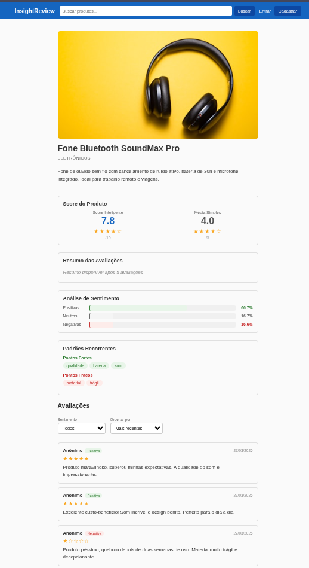

# InsightReview — Plataforma Inteligente de Avaliação de Produtos

Plataforma web onde usuários avaliam produtos com apoio de Inteligência Artificial para organizar avaliações, gerar insights automáticos e ajudar na tomada de decisões de compra.

## Sumário

- [Sobre o Projeto](#sobre-o-projeto)
- [Tecnologias Utilizadas](#tecnologias-utilizadas)
- [Estrutura do Projeto](#estrutura-do-projeto)
- [Instruções de Instalação](#instruções-de-instalação)
- [Docker](#docker)
- [Dados de Exemplo (Seed)](#dados-de-exemplo-seed)
- [Testes](#testes)
- [Motor de IA](#motor-de-ia)
- [Documentação](#documentação)
- [Integrantes](#integrantes)

## Sobre o Projeto

O InsightReview resolve o problema de sobrecarga de informações em avaliações online, transformando dados brutos em insights acionáveis através de IA.

## Integrantes


| Nome                     |
|--------------------------|
| Emesson Cavalcante       |
| Denis Mendes Valgas      |
| Lucas Almeida            |
| Marco Aurélio Alencastro |
| Diego Roberto da Silva   |

---

### Funcionalidades

- **Análise de Sentimento** — Classificação automática das avaliações (positiva, neutra, negativa)
- **Resumo Automático** — IA sintetiza opiniões em pontos claros (positivos e negativos)
- **Detecção de Padrões** — Identificação de problemas e qualidades recorrentes nos produtos
- **Score Inteligente** — Pontuação ponderada (0-10) mais confiável que a média aritmética simples

### Referência Visual



## Tecnologias Utilizadas

| Camada       | Tecnologia                                  |
|--------------|---------------------------------------------|
| Frontend     | React 18, React Router, Axios, Vite         |
| Backend      | Node.js, Express, SQLite (better-sqlite3)   |
| Motor IA     | Integrado ao backend (heurístico)           |
| Testes       | Jest, fast-check, React Testing Library     |
| Infra        | Docker, Docker Compose, Nginx               |

## Estrutura do Projeto

```
grupo-3-plataforma-de-avaliacao-inteligente/
├── backend/
│   ├── src/
│   │   ├── ai-engine/       # Motor de IA (sentimento, resumo, padrões, score)
│   │   ├── controllers/     # Lógica de controle das rotas
│   │   ├── database/        # Conexão, schema e seed do banco
│   │   ├── middleware/      # Auth, validação, rate limiting, erros
│   │   ├── models/          # Modelos de dados (user, product, review, insight)
│   │   ├── routes/          # Definição de rotas da API REST
│   │   ├── services/        # Lógica de negócio
│   │   ├── __tests__/       # Testes de propriedade e e2e
│   │   └── server.js        # Entry point do servidor Express
│   ├── Dockerfile
│   ├── .env.example
│   └── package.json
├── frontend/
│   ├── src/
│   │   ├── components/      # Componentes React (auth, product, review, insights)
│   │   ├── contexts/        # Context API (AuthContext)
│   │   ├── hooks/           # Custom hooks (useAuth, useProducts, useReviews, useInsights)
│   │   ├── services/        # Chamadas à API (axios)
│   │   ├── utils/           # Validadores reutilizáveis
│   │   ├── App.jsx          # Rotas e layout principal
│   │   └── main.jsx         # Entry point React
│   ├── Dockerfile
│   ├── nginx.conf           # Configuração Nginx (proxy reverso + SPA)
│   └── package.json
├── docker-compose.yml        # Orquestração dos containers
├── scripts/
│   └── docker-seed.sh        # Script para popular banco via Docker
├── .kiro/
│   ├── specs/               # Especificações de features
│   └── steering/            # Regras e padrões do projeto
├── docs/                    # Mocks e documentação visual
└── README.md
```

## Instruções de Instalação

### Pré-requisitos

- Node.js 18+
- npm

### Backend

```bash
cd backend
cp .env.example .env
npm install
npm run seed    # Popula o banco com dados de exemplo
npm run dev     # Inicia o servidor na porta 3000
```

### Frontend

```bash
cd frontend
npm install
npm run dev     # Inicia o Vite na porta 5173
```

Acesse `http://localhost:5173` no navegador.

### Usuários de teste (após seed)

| E-mail            | Senha      |
|-------------------|------------|
| maria@teste.com   | senha1234  |
| joao@teste.com    | senha1234  |
| ana@teste.com     | senha1234  |

## Docker 🐋

Para rodar tudo com Docker (recomendado):

```bash
# Sobe backend + frontend com um comando
docker compose up --build

# Em outro terminal, popula o banco com dados de exemplo
bash scripts/docker-seed.sh
```

Acesse `http://localhost` — o Nginx serve o frontend e faz proxy reverso para a API.

### Variáveis de ambiente (Docker)

| Variável     | Padrão                                    | Descrição                        |
|--------------|-------------------------------------------|----------------------------------|
| PORT         | 3000                                      | Porta do backend                 |
| JWT_SECRET   | insightreview-secret-mude-em-producao     | Chave secreta para tokens JWT    |
| DB_PATH      | /app/data/insightreview.db                | Caminho do banco SQLite          |
| NODE_ENV     | production                                | Ambiente de execução             |

Para customizar o JWT_SECRET:

```bash
JWT_SECRET=minha-chave-secreta docker compose up --build
```

## Dados de Exemplo (Seed)

O banco começa vazio. Para popular com dados de exemplo:

```bash
# Local
cd backend && npm run seed

# Docker
bash scripts/docker-seed.sh
```

O seed cria 3 usuários, 5 produtos, 16 avaliações com sentimentos classificados e insights pré-calculados.

## Testes

```bash
# Backend — unitários, integração, propriedade e e2e
cd backend && npm test

# Frontend — unitários e componentes
cd frontend && npm test
```

Os testes de propriedade (fast-check) validam 24 propriedades de corretude com 100 iterações cada, cobrindo autenticação, produtos, avaliações e motor de IA.

## Motor de IA

O motor de IA é integrado ao backend e processa avaliações de forma assíncrona:

| Módulo                  | Arquivo                              | Função                                                    |
|-------------------------|--------------------------------------|-----------------------------------------------------------|
| Análise de Sentimento   | `ai-engine/sentiment-analyzer.js`    | Classifica texto como positivo/neutro/negativo (SLA: 30s) |
| Resumo Automático       | `ai-engine/summary-generator.js`     | Gera pontos positivos e negativos (≥5 avaliações)         |
| Detecção de Padrões     | `ai-engine/pattern-detector.js`      | Identifica termos recorrentes por sentimento (≥10 aval.)  |
| Score Inteligente       | `ai-engine/score-calculator.js`      | Pontuação 0-10 ponderada: nota+sentimento+recência (≥3)   |
| Fila de Processamento   | `ai-engine/ai-queue.js`              | Processamento assíncrono com retentativas (backoff exp.)   |

A implementação atual é heurística (palavras-chave e frequência de termos) — adequada para POC. Para produção, os módulos seriam substituídos por modelos de NLP mantendo a mesma interface.

## Documentação

- [Requisitos](.kiro/specs/smart-product-reviews/requirements.md)
- [Design Técnico](.kiro/specs/smart-product-reviews/design.md)
- [Tasks de Implementação](.kiro/specs/smart-product-reviews/tasks.md)
- [PRD](docs/PRD.md)
